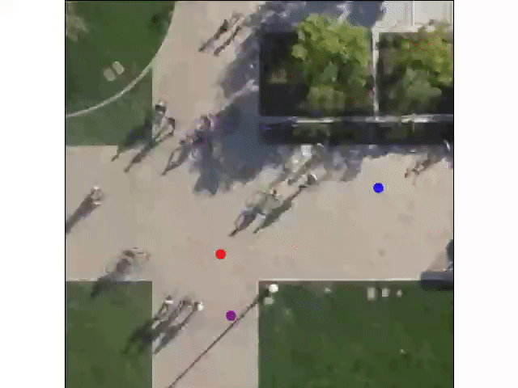
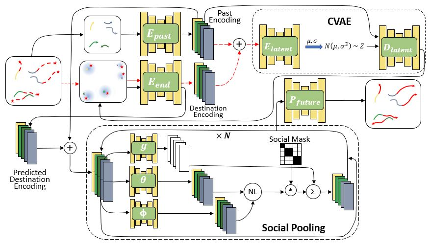

# PECNet: Pedestrian Endpoint Conditioned Trajectory Prediction Network

This repository contains the code for the paper **[It is Not the Journey but the Destination: Endpoint Conditioned Trajectory Prediction](https://karttikeya.github.io/publication/htf/)**. 

**<a href="https://arxiv.org/abs/2004.02025">It is Not the Journey but the Destination: Endpoint Conditioned Trajectory Prediction</a>**
<br>
<a href="https://karttikeya.github.io/">Karttikeya Mangalam</a>,
<a href="https://www.linkedin.com/in/harshayu-girase-764b06153/">Harshayu Girase</a>,
<a href="https://www.linkedin.com/in/shreyas-agarwal-086267146/">Shreyas Agarwal</a>,
<a href="https://www.linkedin.com/in/kuan-hui-lee-23730370/">Kuan-Hui Lee</a>,
<a href="https://web.stanford.edu/~eadeli/">Ehsan Adeli</a>,
<a href="https://people.eecs.berkeley.edu/~malik/">Jitendra Malik</a>,
<a href="https://www.linkedin.com/in/adrien-gaidon-63ab2358/">Adrien Gaidon</a>
<br>
Accepted to [ECCV 2020](https://eccv2020.eu/)(Oral)


**Abstract**: Human trajectory forecasting with multiple socially interacting agents is of critical importance for autonomous navigation in human
environments, e.g., for self-driving cars and social robots. In this work, we present Predicted Endpoint Conditioned Network (PECNet) for flexible
human trajectory prediction. PECNet infers distant trajectory endpoints to assist in long-range multi-modal trajectory prediction. A novel nonlocal social pooling layer enables PECNet to infer diverse yet socially compliant trajectories. Additionally, we present a simple “truncation trick” for improving diversity and multi-modal trajectory prediction performance. 

Below is an example of pedestrian trajectories predicted by our model and the corresponding ground truth. Each person is denoted by a different color, the past is denoted by circles, and the future is denoted by stars. The past is the same for both predictions and ground truth. The left image shows the future trajectory that our model predicts and the right image shows the ground truth future trajectory that actually occurs.
<div align='center'>
</img>
</img>
</div>

If you find this code useful in your work then please cite
  ```
  @inproceedings{mangalam2020pecnet,
    title={It is Not the Journey but the Destination: Endpoint Conditioned Trajectory Prediction},
    author={Mangalam, Karttikeya and Girase, Harshayu and Agarwal, Shreyas and Lee, Kuan-Hui and Adeli, Ehsan and Malik, Jitendra and Gaidon, Adrien},
    booktitle = {Proceedings of the European Conference on Computer Vision (ECCV)},
    month = {August},
    year={2020}
  }
  ```
  ```
  @inproceedings{mangalam2021goals,
   author = {Mangalam, Karttikeya and An, Yang and Girase, Harshayu and Malik, Jitendra},
   title = {From Goals, Waypoints \& Paths To Long Term Human Trajectory Forecasting},
   booktitle = {Proc. International Conference on Computer Vision (ICCV)},
   year = {2021},
   month = oct,
   month_numeric = {10}
  }
  ```

## Model
Our model consists of two sequential steps: an endpoint prediction module and a social pooling module. The endpoint prediction module is a CVAE which models the desired end destination of a pedestrian as a representation of its past observed trajectories. The social pooling module considers the past history of all the pedestrians in the scene and their predicted endpoints from the endpoint module to predict socially compliant future trajectories.

<div align='center'>
  
</div>

## Setup
All code was developed and tested on Ubuntu 16.04.6 with Python 3.6.6 and PyTorch 1.4.0 with CUDA 10.0.

## Pretrained Models
Pretrained models are available in the `saved_models` folder.

## Configuration File
Configuration files (or config files) are used to load parameters such as hidden layer dimensions or learning rates into a model to be trained. To do this, first edit any of the parameters in the contents dictionary in config_gen.py in the config folder. Next, run config_gen.py using the following commands:
```bash
# Start in the project root directory
cd config
python config_gen.py -fn <config_save_name>
```
where config_save_name is the name that the config file should be saved with ending in .yaml.

## Running Models
You can run the commmands:
```bash
# Start in the project root directory
cd scripts
python test_pretrained_model.py -lf <file_to_load>
```
to easily run any of the pretrained models. The `file_to_load` is the name of the model ending in `.pt` in the `saved_models` folder. For example you can replicate our Table 1 results like this:

```bash
# Start in the project root directory
cd scripts
python test_pretrained_model.py -lf PECNET_social_model1.pt
```

## Training new models
To train a new model, you can run the command:
```bash
# Start in the project root directory
cd scripts
python training_loop.py -cfn <config_file_name> -sf <model_save_name>
```
where `config_file_name` is the name of the config file used to load the configuration parameters ending in `.yaml` and `model_save_name` is the name that is used when saving the model ending in `.pt`. You can use our optimal parameters as given by `optimal.yaml` or create your own config file by changing parameters in and running `config_gen.py` in the config folder.

## Accessing Data
This repo contains processed pickle files used for the Stanford Drone Dataset (SDD). We also provide processing scripts and data for the ETH/UCY datasets available here: https://drive.google.com/drive/folders/1ee9h_WtoXZhXZPT0H55uDFZaSmoArbf0?usp=sharing.
