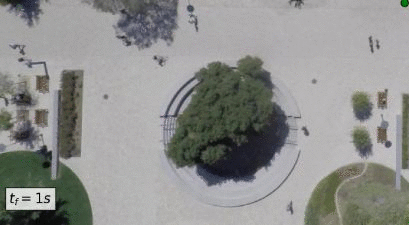
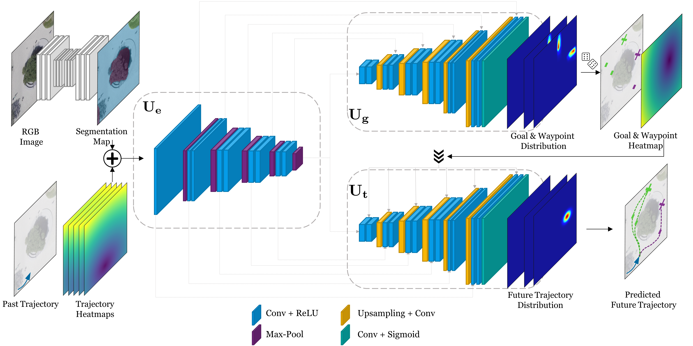

# Y-net

This repository contains the code for the following ICCV'21 paper:

**[From Goals, Waypoints & Paths To Long Term Human Trajectory Forecasting](https://arxiv.org/abs/2012.01526)** \
[Karttikeya Mangalam*](https://karttikeya.github.io/),
[Yang An*](https://scholar.google.com/citations?user=9r5U-vsAAAAJ&hl=en),
[Harshayu Girase](https://scholar.google.com/citations?user=alhRQ2IAAAAJ&hl=en)
[Jitendra Malik](http://people.eecs.berkeley.edu/~malik/),

If you find this code useful in your work then please cite
  ```
  @inproceedings{mangalam2020pecnet,
    title={It is Not the Journey but the Destination: Endpoint Conditioned Trajectory Prediction},
    author={Mangalam, Karttikeya and Girase, Harshayu and Agarwal, Shreyas and Lee, Kuan-Hui and Adeli, Ehsan and Malik, Jitendra and Gaidon, Adrien},
    booktitle = {Proceedings of the European Conference on Computer Vision (ECCV)},
    month = {August},
    year={2020}
  }
  ```
  ```
  @inproceedings{mangalam2021goals,
   author = {Mangalam, Karttikeya and An, Yang and Girase, Harshayu and Malik, Jitendra},
   title = {From Goals, Waypoints \& Paths To Long Term Human Trajectory Forecasting},
   booktitle = {Proc. International Conference on Computer Vision (ICCV)},
   year = {2021},
   month = oct,
   month_numeric = {10}
  }
  ```

## Abstract
Human trajectory forecasting is an inherently multimodal problem. Uncertainty in future trajectories stems from two sources: (a) sources that are known to the agent but unknown to the model, such as long term goals and (b) sources that are unknown to both the agent & the model, such as intent of other agents & irreducible randomness in decisions. We propose to factorize this uncertainty into its epistemic & aleatoric sources. We model the epistemic uncertainty through multimodality in long term goals and the aleatoric uncertainty through multimodality in waypoints & paths. To exemplify this dichotomy, we also propose a novel long term trajectory forecasting setting, with prediction horizons upto a minute, upto an order of magnitude longer than prior works. Finally, we present Y-net, a scene compliant trajectory forecasting network that exploits the proposed epistemic & aleatoric structure for diverse trajectory predictions across long prediction horizons. Y-net significantly improves previous state-of-the-art performance on both (a) The short prediction horizon setting on the Stanford Drone (31.7% in FDE) & ETH/UCY datasets (7.4% in FDE) and (b) The proposed long horizon setting on the re-purposed Stanford Drone & Intersection Drone datasets.
<div align='center'>
</img>
</img>
</div>


## Model
<div align="center">
</img>
</div>

## Setup
All code was developed and tested on Windows 10 with Python 3.8.3 and PyTorch 1.5.1 with CUDA 10.2. The necessary libraries can be found in the requirements.txt. Note that PyTorch and nb_conda_kernels are commented out in the requirements.txt to be compatible with different systems and CUDA versions and needs to be manually installed. 

## Pretrained Models, Data and Config files
Please download the pretrained models, data and config files from: https://drive.google.com/file/d/1u4hTk_BZGq1929IxMPLCrDzoG3wsZnsa/view?usp=sharing
Extract the zip file into the main folder.

**Due to copyright, we cannot provide data from the inD dataset**
Please request the inD file from the authors and then use the `utils/preprocessing_inD.py` file for preprocessing.


## Configuration File
Configuration files (or config files) are used to load hyperparameters such as hidden layer dimensions or learning rates into a model to be trained. The hyperparameters can be easily changed in the corresponding yaml files.

## Tutorials for training and evaluation 
Please find the tutorials for training new models and evaluating pretrained models in the corresponding notebooks.
